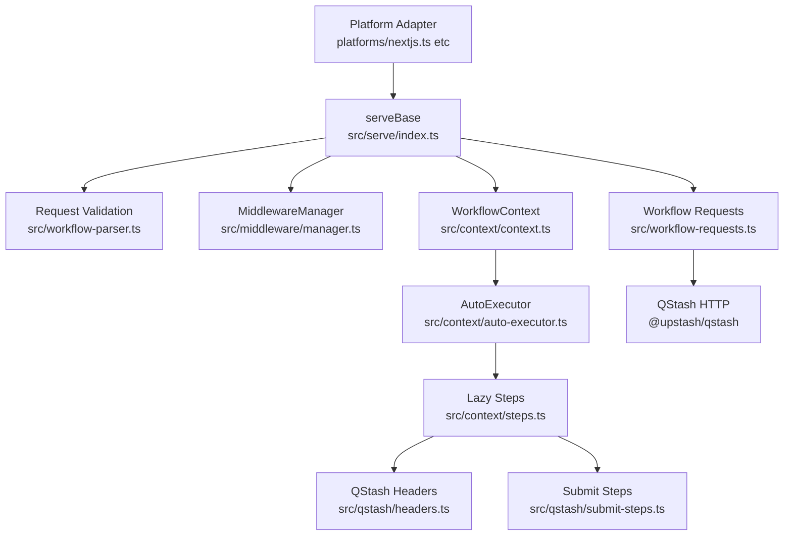

This SDK is organized around a small set of core modules: `serve` orchestrates incoming requests, `WorkflowContext` exposes the step API, and `AutoExecutor` handles step planning and execution. Surrounding them are helper modules for QStash communication, workflow parsing, and middleware hooks.

**Key Design Decisions**
- **Serve-first orchestration**: `serveBase` in `src/serve/index.ts` owns the request lifecycle so platform adapters are thin wrappers. This keeps framework integrations consistent and minimizes duplicated logic.
- **Step planning via lazy steps**: Each step is represented as a `BaseLazyStep` in `src/context/steps.ts`. This allows the SDK to decide whether a step can be resolved from existing QStash state or must be submitted as a new step.
- **AutoExecutor state machine**: `AutoExecutor` in `src/context/auto-executor.ts` tracks step counts and parallel call state. It enforces determinism, detects nested steps, and handles parallel planning and replay.
- **QStash header protocol**: All requests are normalized and tagged using `src/qstash/headers.ts`. This creates a uniform protocol across first invocation, step submissions, callbacks, and failure flows.
- **Middleware separation**: Middleware callbacks are orchestrated in `src/middleware/manager.ts`, keeping lifecycle and debug events isolated from business logic.

**How the Pieces Fit Together**
1. A platform adapter such as `platforms/nextjs.ts` calls `serveBase` and returns a handler.
2. `serveBase` validates the request in `src/workflow-parser.ts` and chooses the correct QStash handlers via `src/serve/multi-region/handlers.ts`.
3. The request is parsed into steps. If it is the first invocation, a new workflow run is triggered via `src/workflow-requests.ts`.
4. `WorkflowContext` is created with the parsed steps and user headers. It exposes `run`, `sleep`, `call`, `waitForEvent`, and more.
5. Each `context.*` call creates a lazy step that the `AutoExecutor` manages. The executor decides whether to replay from existing steps or submit new steps to QStash.
6. Step submissions go through `src/qstash/submit-steps.ts`, which builds headers with `src/qstash/headers.ts` and publishes to QStash.
7. Middleware hooks are triggered before and after execution, and debug events are emitted for key lifecycle transitions.

The result is a workflow system that behaves like sequential code while executing across multiple durable invocations.
