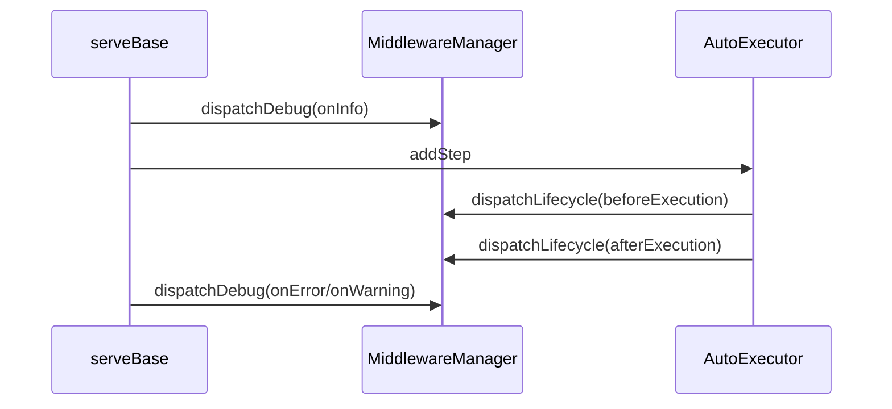

Middleware gives you structured visibility into workflow execution without mixing logging or metrics into your step code. The SDK defines debug events (`onInfo`, `onWarning`, `onError`) and lifecycle events (`beforeExecution`, `afterExecution`, `runStarted`, `runCompleted`).

**What it is**
A middleware is an instance of `WorkflowMiddleware` from `src/middleware/middleware.ts`. It provides callbacks that the `MiddlewareManager` invokes during request handling and step execution.

**Why it exists**
- Centralize logging, tracing, or metrics for all workflows.
- Observe step boundaries and failures without polluting business logic.
- Provide consistent diagnostics across frameworks.

**How it relates to other concepts**
- `serveBase` in `src/serve/index.ts` creates a `MiddlewareManager` per request.
- The manager assigns the workflow run ID and context to callbacks.
- `AutoExecutor` and `submit-steps.ts` trigger lifecycle and debug events.



**Basic usage: logging middleware**
```typescript filename="src/middleware/logging.ts"
import { WorkflowMiddleware } from "@upstash/workflow";

export const metrics = new WorkflowMiddleware({
  name: "metrics",
  callbacks: {
    beforeExecution: ({ stepName }) => console.log("start", stepName),
    afterExecution: ({ stepName }) => console.log("end", stepName),
    onError: ({ error }) => console.error(error.message),
  },
});
```

**Advanced usage: async init + environment binding**
```typescript filename="src/middleware/init.ts"
import { WorkflowMiddleware } from "@upstash/workflow";

export const tracing = new WorkflowMiddleware({
  name: "tracing",
  init: async () => {
    const client = await createTracingClient();
    return {
      runStarted: () => client.startSpan("workflow"),
      runCompleted: ({ result }) => client.endSpan({ result }),
      onWarning: ({ warning }) => client.capture("warn", warning),
    };
  },
});
```

<Callout type="warn">
Lifecycle callbacks require an assigned context. If you manually construct a `MiddlewareManager`, you must call `assignContext` before dispatching lifecycle events. Otherwise `dispatchLifecycle` throws a `WorkflowError`.
</Callout>

<Accordions>
<Accordion title="Synchronous vs async callbacks">
Middleware callbacks can be async, and the manager will await them. This provides strong consistency for logging and metrics, but it also means heavy middleware can add latency to every invocation. If you need high throughput, keep callbacks lightweight and offload heavy work to your own background systems. Consider capturing only IDs in middleware and processing details later. The SDK favors correctness and ordering over raw speed here.
</Accordion>
<Accordion title="Verbose logging vs signal quality">
Enabling `verbose` in `WorkflowServeOptions` adds `loggingMiddleware` by default. This is great during integration because you get step-level visibility, but it can be noisy and increase log volume. In production, prefer targeted custom middleware that emits structured logs or metrics. You can still enable verbose logging on specific workflows when debugging incidents. The trade-off is between always-on visibility and operational cost.
</Accordion>
</Accordions>
