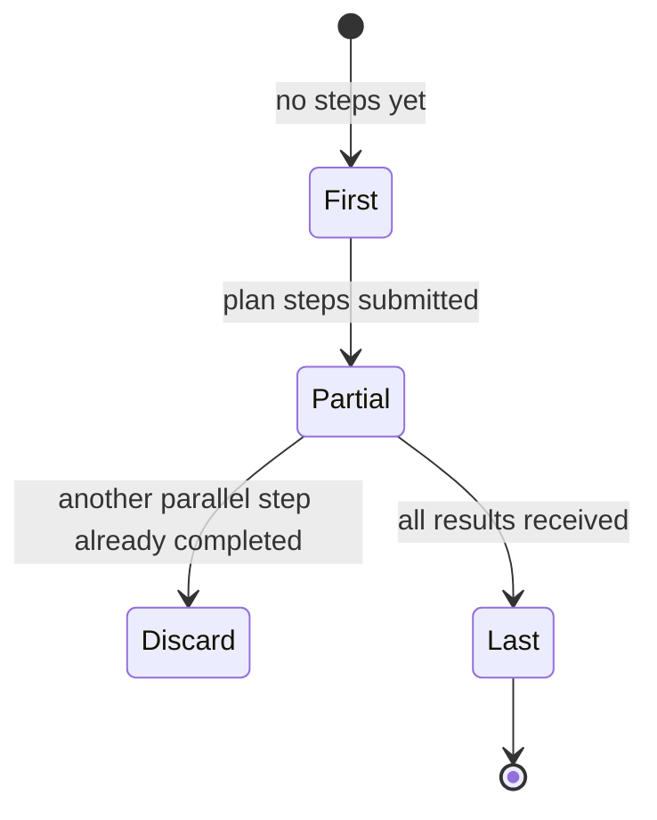

Parallelism in Upstash Workflow is explicit and deterministic. When you call multiple steps inside `Promise.all`, the SDK plans a parallel execution, submits plan steps, and then rehydrates each result as it arrives. This behavior is orchestrated by `AutoExecutor` in `src/context/auto-executor.ts`.

**What this concept is**
Parallel steps are represented as a list of lazy steps submitted together. QStash will call back for each step result, and the SDK reconciles those callbacks with the planned step list.

**Why it exists**
- It allows concurrency without losing deterministic replay.
- It ensures all parallel steps are accounted for and validated.
- It prevents inconsistent step definitions between deployments.

**How it relates to other concepts**
- `WorkflowContext` collects lazy steps when you call `context.run` in parallel.
- `AutoExecutor` decides the parallel call state and validates step names/types.
- `submitParallelSteps` in `src/qstash/submit-steps.ts` publishes plan steps to QStash.



**How it works internally**
- When multiple steps are queued before the microtask boundary, `AutoExecutor` groups them.
- It computes the parallel call state using `getParallelCallState` and the existing step list.
- On the first invocation, it submits plan steps and throws `WorkflowAbort` to end the invocation.
- On partial invocations, it validates step name/type and submits the result step.
- On the final invocation, it validates all results and returns them to your code.

**Basic usage: parallel steps**
```typescript filename="app/api/workflow/route.ts"
import { serve } from "@upstash/workflow/nextjs";

export const { POST } = serve(async (context) => {
  const [user, orders] = await Promise.all([
    context.run("fetch-user", () => fetch("https://example.com/user").then((r) => r.json())),
    context.run("fetch-orders", () => fetch("https://example.com/orders").then((r) => r.json())),
  ]);

  await context.run("summary", () => ({ userId: user.id, orderCount: orders.length }));
});
```

**Advanced usage: parallel sleeps with mixed step types**
```typescript filename="app/api/workflow/route.ts"
import { serve } from "@upstash/workflow/nextjs";

export const { POST } = serve(async (context) => {
  const [_, call] = await Promise.all([
    context.sleep("wait-short", "10s"),
    context.call<{ ok: boolean }>("check", { url: "https://example.com/health" }),
  ]);

  if (!call.body.ok) {
    await context.run("alert", () => console.warn("health check failed"));
  }
});
```

<Callout type="warn">
Parallel step counts must remain stable. If you conditionally add steps inside `Promise.all`, the SDK may detect an incompatible number of parallel steps and throw a `WorkflowError`. Always build the list deterministically, or split conditional branches into separate sequential steps.
</Callout>

<Accordions>
<Accordion title="Determinism vs dynamic parallelism">
The SDK validates that step names and types match the planned steps. This prevents silent corruption but makes truly dynamic parallelism difficult. If you need dynamic fan-out, collect the dynamic list first in a single step, then submit parallel steps based on that list in a second, stable phase. The trade-off is a slightly more complex structure in exchange for reliable replay and safety.
</Accordion>
<Accordion title="Plan steps vs direct execution">
Plan steps exist so QStash can schedule and execute parallel branches independently. This adds an extra message round-trip but ensures that each parallel branch is durable and independently retryable. Direct in-process parallelism would be faster but would lose durability across failures. The plan step approach keeps the workflow consistent across retries and partial completions. For small, short-lived operations, sequential steps may be simpler.
</Accordion>
</Accordions>
