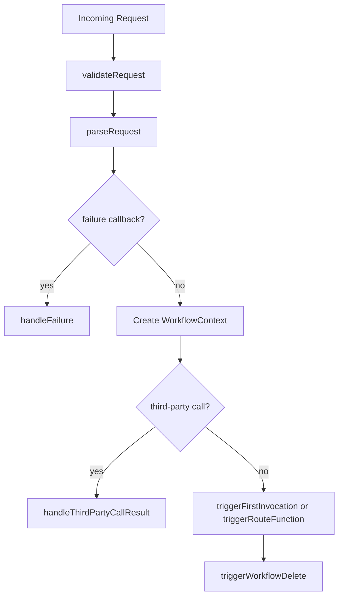

`serve` is the entry point for running a workflow. Under the hood, `serveBase` in `src/serve/index.ts` handles request validation, payload parsing, failure callbacks, third-party call returns, and step execution.

**Why it exists**
- It provides a consistent execution model across frameworks.
- It ensures requests are verified and parsed correctly.
- It keeps workflow invocations deterministic and durable.

**How it relates to other concepts**
- It creates `WorkflowContext` and connects it to `AutoExecutor`.
- It delegates request parsing to `src/workflow-parser.ts`.
- It handles third-party call results in `src/workflow-requests.ts`.
- It relies on QStash handler selection from `src/serve/multi-region/handlers.ts`.



**How it works internally**
- `validateRequest` checks protocol headers and whether this is the first invocation.
- `parseRequest` either returns an initial payload or fetches steps from QStash for lazy fetch.
- `handleFailure` is invoked when a failure callback is signaled; it runs your `failureFunction`.
- `handleThirdPartyCallResult` detects callbacks from `context.call` and submits results to QStash.
- `triggerRouteFunction` runs your workflow and uses `WorkflowAbort` to end the invocation after a step is submitted.

**Basic usage: serve with schema validation**
```typescript filename="app/api/workflow/route.ts"
import { serve } from "@upstash/workflow/nextjs";
import { z } from "zod";

const Payload = z.object({ email: z.string().email() });

export const { POST } = serve<z.infer<typeof Payload>>(
  async (context) => {
    await context.run("send", () => console.log(context.requestPayload.email));
  },
  { schema: Payload }
);
```

**Advanced usage: failure function and telemetry control**
```typescript filename="app/api/workflow/route.ts"
import { serve } from "@upstash/workflow/nextjs";

export const { POST } = serve(
  async (context) => {
    await context.run("work", () => {
      throw new Error("boom");
    });
  },
  {
    disableTelemetry: true,
    failureFunction: async ({ context, failStatus, failResponse }) => {
      await context.run("log-failure", () => {
        console.error(failStatus, failResponse);
      });
      return "failure handled";
    },
  }
);
```

<Callout type="warn">
Requests that do not originate from QStash may fail verification when signing keys are configured. If you want to test locally, either publish through QStash or clear `QSTASH_CURRENT_SIGNING_KEY` and `QSTASH_NEXT_SIGNING_KEY` in your environment for local runs.
</Callout>

<Accordions>
<Accordion title="Verification vs local iteration">
Signature verification in `verifyRequest` protects your workflow endpoint from unauthorized calls. This is essential in production, but it can slow local testing if you call the endpoint directly. The SDK supports disabling verification by removing signing key environment variables, which trades security for convenience. A safer pattern is to use QStash even in development so your workflow is exercised in the same way as production. Use local tunnels if your platform requires public URLs.
</Accordion>
<Accordion title="Failure callbacks vs inline error handling">
Failure callbacks run after QStash retries are exhausted. This lets you separate failure handling from normal workflow logic and keeps main workflows focused. The trade-off is that the failure function runs in a separate invocation with a partial context, so it cannot reuse local state from the original run. If you need immediate compensating actions, handle errors inside step functions and return structured results. Use the failure function for durable, centralized failure processing.
</Accordion>
</Accordions>
