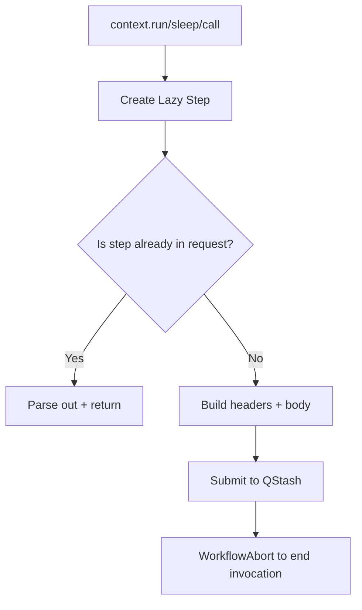

Steps are the durable units of work in Upstash Workflow. Each call to a `context.*` method creates a lazy step object that can be replayed or submitted to QStash. This is what allows workflows to survive timeouts, retries, and platform restarts.

**What a step is**
- A step is represented by the `Step` type in `src/types.ts` and includes `stepId`, `stepName`, `stepType`, and optional fields like `sleepFor`, `callUrl`, or `waitEventId`.
- Steps are created lazily in `src/context/steps.ts` and only submitted when needed.
- When a step result is already present in the incoming request, `AutoExecutor` returns it instead of re-running your function.

**How it relates to other concepts**
- `WorkflowContext` is the public API that creates lazy steps.
- `AutoExecutor` decides whether to submit a new step or replay an existing one.
- `submit-steps.ts` constructs headers and sends the step to QStash.



**How it works internally**
- Each step type subclasses `BaseLazyStep` (`src/context/steps.ts`) and implements `getPlanStep`, `getResultStep`, `getHeaders`, and `getBody`.
- `LazyFunctionStep` runs your function and serializes the result.
- `LazySleepStep` and `LazySleepUntilStep` use QStash scheduling (`delay` or `notBefore`).
- `LazyCallStep` performs external calls and returns results through QStash callbacks.
- `LazyWaitForEventStep` registers a wait via QStash and resumes when notified.

**Basic usage: sleep + call**
```typescript filename="app/api/workflow/route.ts"
import { serve } from "@upstash/workflow/nextjs";

export const { POST } = serve(async (context) => {
  await context.sleep("cooldown", "10s");

  const { status, body } = await context.call<{ ok: boolean }>("check", {
    url: "https://example.com/health",
    method: "GET",
  });

  if (status !== 200 || !body.ok) {
    await context.run("log", () => console.warn("unhealthy"));
  }
});
```

**Advanced usage: invoke and notify**
```typescript filename="app/api/workflow/route.ts"
import { serve } from "@upstash/workflow/nextjs";

export const { POST } = serve(async (context) => {
  const { body } = await context.invoke("start-child", {
    workflow: childWorkflow,
    body: { orderId: "ord_123" },
    retries: 3,
  });

  await context.notify("notify-child", "order.ready", body);
});

const childWorkflow = {
  routeFunction: async (ctx: any) => ctx.run("work", () => ({ ok: true })),
  options: {},
  workflowId: "child",
};
```

<Callout type="warn">
Step outputs are stored and replayed. If you return non-serializable values (like class instances with circular references), JSON serialization will fail and the step will not be durable. Return plain objects, strings, numbers, arrays, or JSON-serializable structures.
</Callout>

<Accordions>
<Accordion title="Lazy steps vs immediate execution">
Lazy steps let the SDK decide whether to run or replay. This gives you deterministic behavior and allows QStash to rehydrate state across invocations. The trade-off is that step boundaries are explicit, and any work outside of step functions is not durable. You should keep expensive or side-effectful logic inside steps rather than in the surrounding route function. The result is a workflow that behaves predictably across retries and failures.
</Accordion>
<Accordion title="Third-party calls and callbacks">
`context.call` does not execute the HTTP request directly. Instead it publishes a request to QStash and expects a callback to your workflow when the remote call completes. This makes the call non-blocking for your runtime and enables retries without holding compute. The cost is that you must handle call responses as step outputs and avoid assuming a synchronous call stack. When you need true in-process calls, use `context.run` with `fetch` instead.
</Accordion>
</Accordions>
