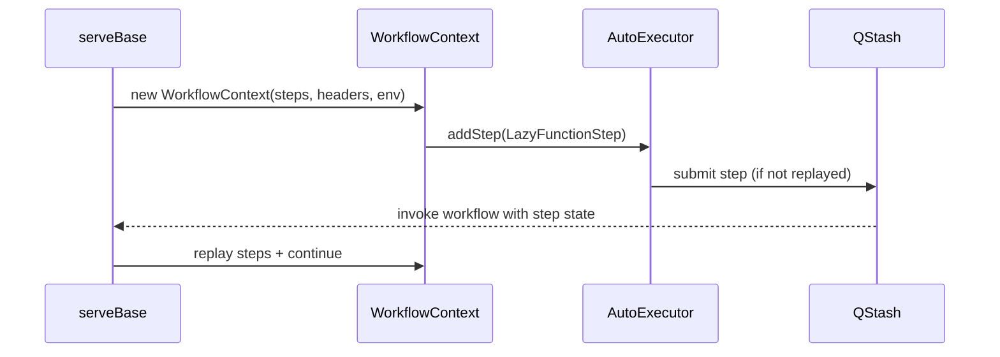

`WorkflowContext` is the primary API you write against. It is created inside `serve` and passed to your route function so you can declare durable steps. Internally it builds lazy steps, hands them to `AutoExecutor`, and translates your business logic into QStash-backed execution.

**Why it exists**
- It centralizes workflow runtime metadata (run ID, headers, payload, env).
- It exposes step methods (`run`, `sleep`, `call`, `waitForEvent`, `notify`, `invoke`) that are durable and replayable.
- It provides a safe boundary for non-deterministic logic by enforcing step ordering and replay semantics.

**How it relates to other concepts**
- `WorkflowContext` is created in `src/serve/index.ts` and is fed `steps` parsed by `src/workflow-parser.ts`.
- Every step method builds a lazy step from `src/context/steps.ts` and delegates execution to `src/context/auto-executor.ts`.
- Middleware hooks receive the context through `src/middleware/manager.ts` lifecycle events.



**How it works internally**
- The constructor in `src/context/context.ts` stores metadata like `workflowRunId`, `requestPayload`, and `env`.
- It creates an `AutoExecutor` with the current `steps` array and optional telemetry.
- Each step method wraps your function in `executor.wrapStep` and calls `executor.addStep`, which decides whether to replay or submit.
- `context.api` exposes provider-specific helpers that still route through `context.call` (see `src/context/api/*`).

**Basic usage**
```typescript filename="app/api/workflow/route.ts"
import { serve } from "@upstash/workflow/nextjs";

export const { POST } = serve<{ userId: string }>(async (context) => {
  const { userId } = context.requestPayload;

  const profile = await context.run("fetch-profile", async () => {
    const res = await fetch(`https://example.com/users/${userId}`);
    return res.json();
  });

  await context.sleep("cooldown", "30s");
  await context.run("notify", () => console.log("done", profile.id));
});
```

**Advanced usage: invoke a child workflow and wait for an event**
```typescript filename="app/api/workflow/route.ts"
import { serve } from "@upstash/workflow/nextjs";

export const { POST } = serve(async (context) => {
  const { body } = await context.invoke("start-child", {
    workflow: childWorkflow,
    body: { task: "reconcile" },
  });

  const wait = await context.waitForEvent<{ status: string }>(
    "await-status",
    `reconcile.${body.id}`,
    { timeout: "1h" }
  );

  if (wait.timeout) {
    await context.run("handle-timeout", () => console.warn("timed out"));
  }
});

const childWorkflow = {
  routeFunction: async (ctx: any) => ctx.run("work", () => ({ id: "42" })),
  options: {},
  workflowId: "reconcile",
};
```

<Callout type="warn">
Avoid running `context.run`, `context.sleep`, `context.call`, or other step methods inside a `try/catch` that swallows errors. Step execution uses `WorkflowAbort` internally to stop the current invocation, so catching and ignoring it can lead to double execution or stuck workflows. Also avoid starting a step inside another step function; `AutoExecutor` will throw a `WorkflowError` for nested steps.
</Callout>

<Accordions>
<Accordion title="Determinism vs flexibility">
`WorkflowContext` uses a dry-run authorization pass before executing steps (see `src/serve/authorization.ts`). This ensures that any authentication logic that runs before the first step is safe, but it also means non-deterministic code before your first step can behave differently between the dry-run and the real run. If you rely on random values or timestamps before the first step, you can accidentally pass auth during the dry-run and fail during execution. The trade-off is intentional: it gives you a safe place for auth checks while preserving deterministic step replay. Move non-deterministic code inside `context.run` to keep behavior consistent.
</Accordion>
<Accordion title="Step naming and replay stability">
Steps are matched by `stepName` and `stepType` during replay in `src/context/auto-executor.ts`. Changing a step name or type between deployments will cause `WorkflowError` on replay because the incoming step sequence no longer matches the expected plan. The benefit is strong safety against silent corruption: you will know immediately when a workflow definition changed in a breaking way. The cost is that you must treat step names as stable API once workflows are in flight. If you need to refactor, add new steps instead of renaming existing ones.
</Accordion>
</Accordions>
