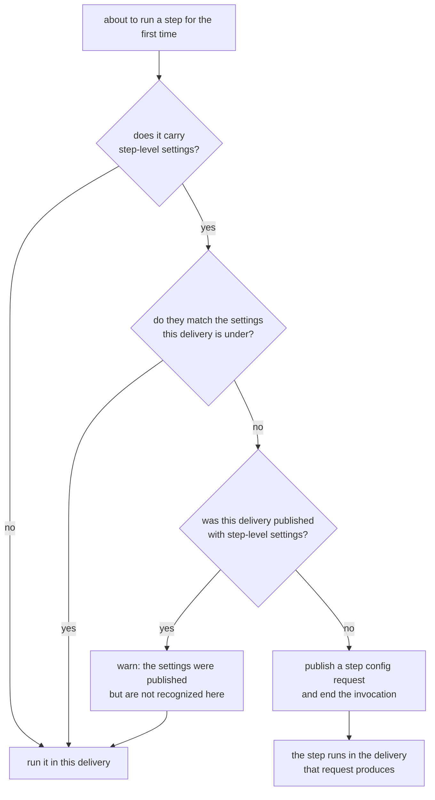
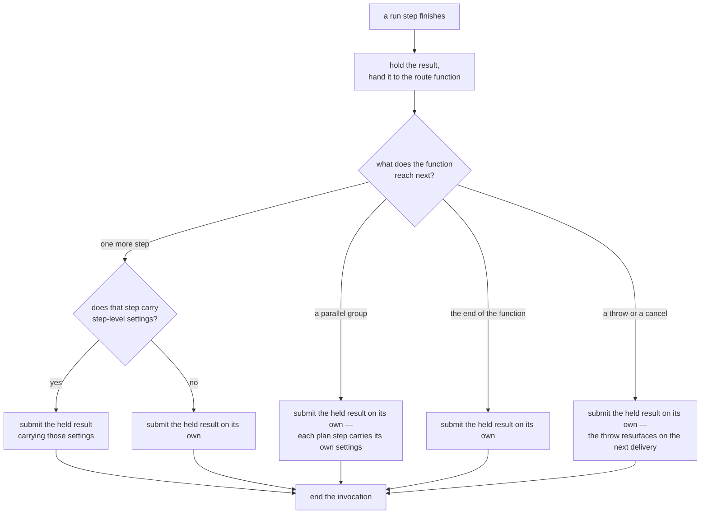
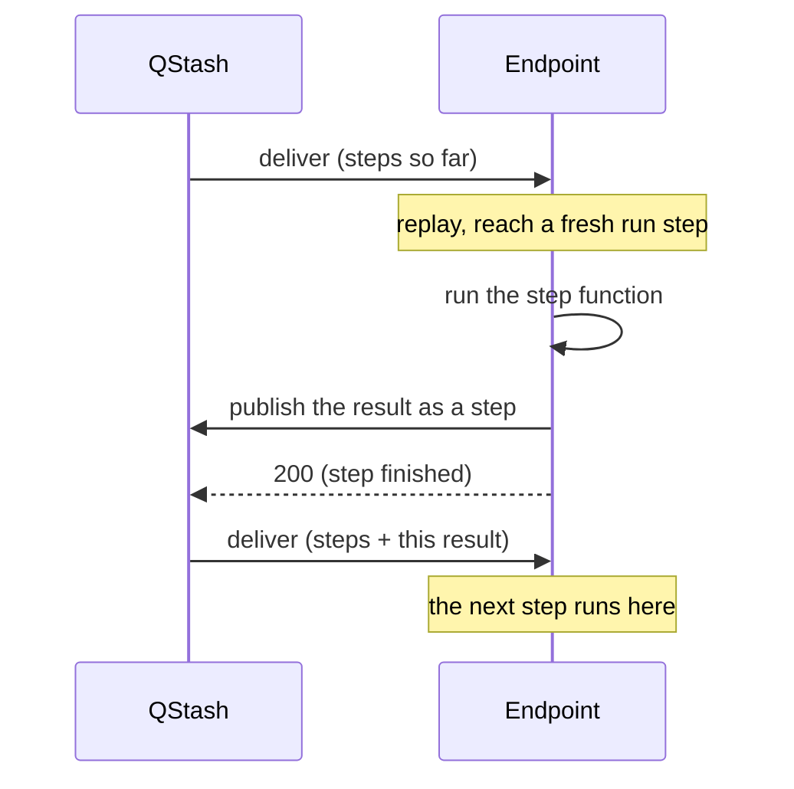
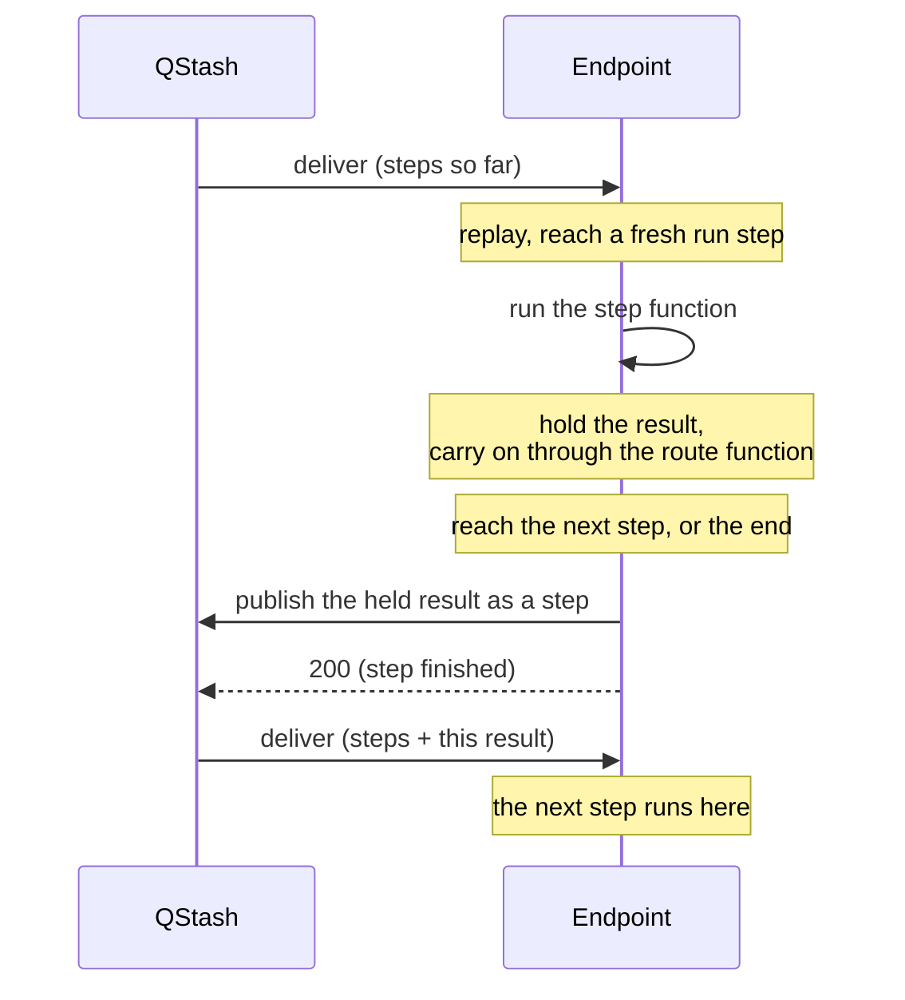
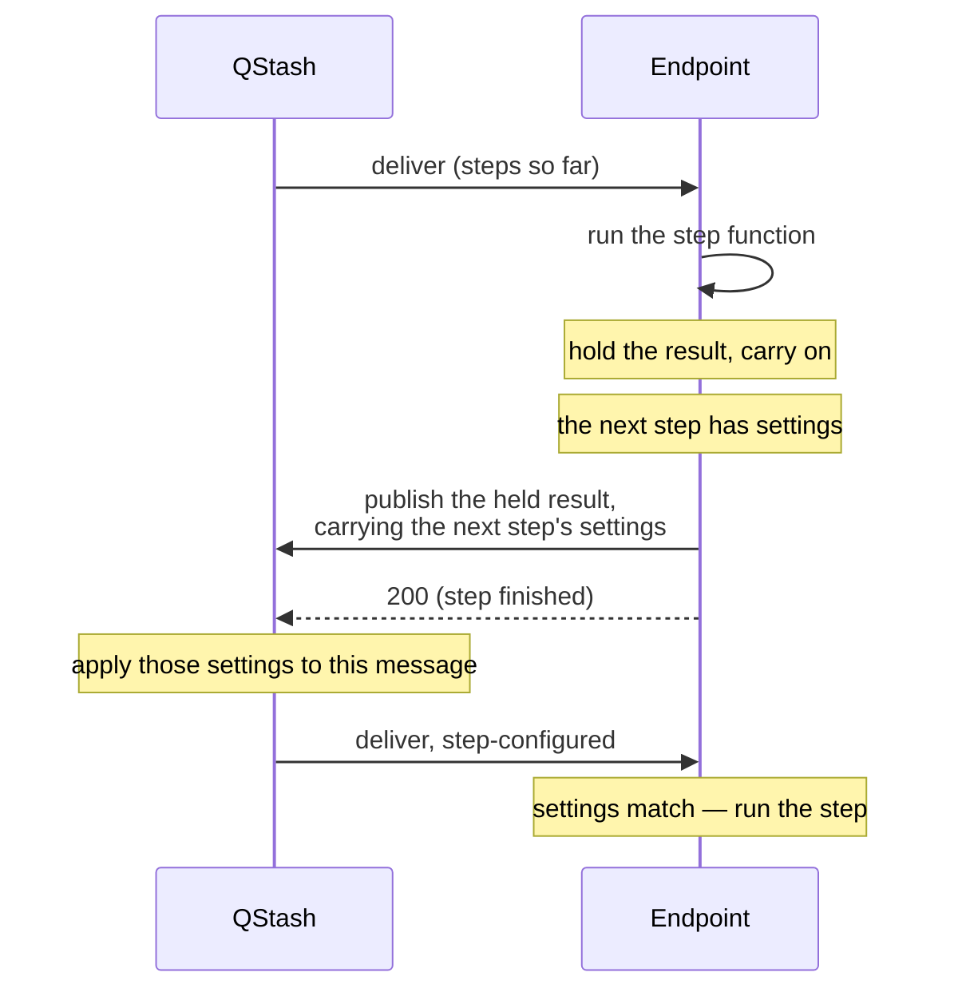
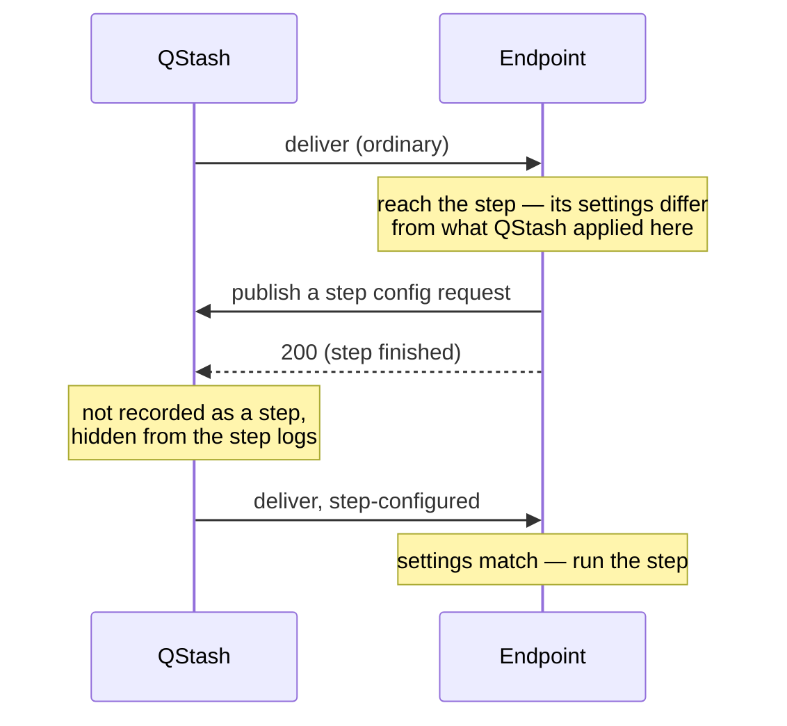
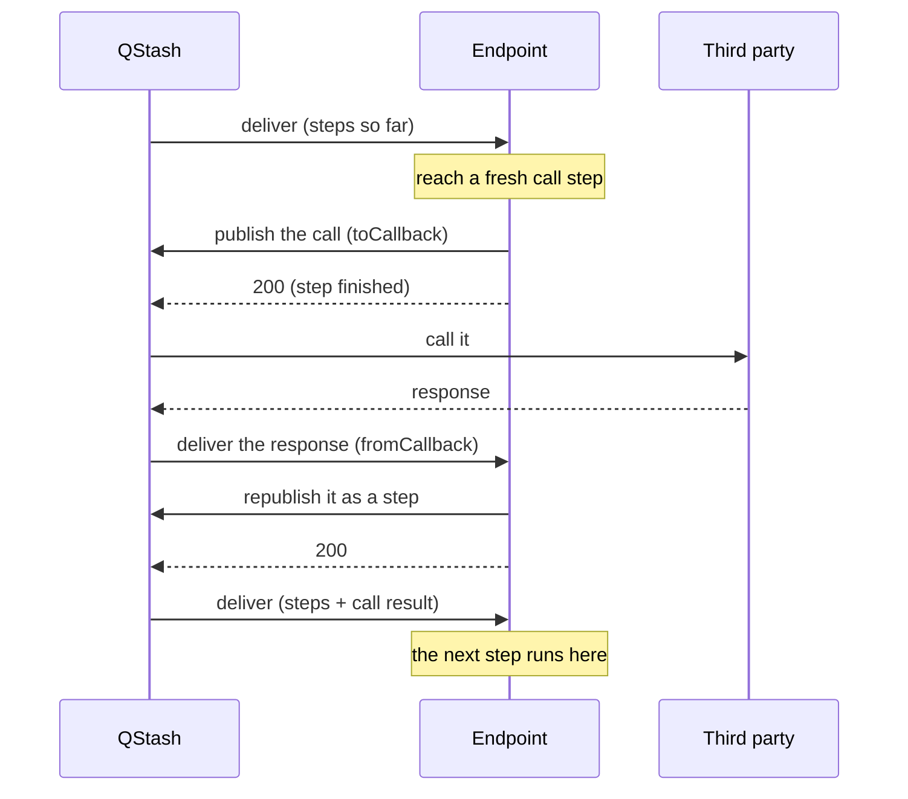
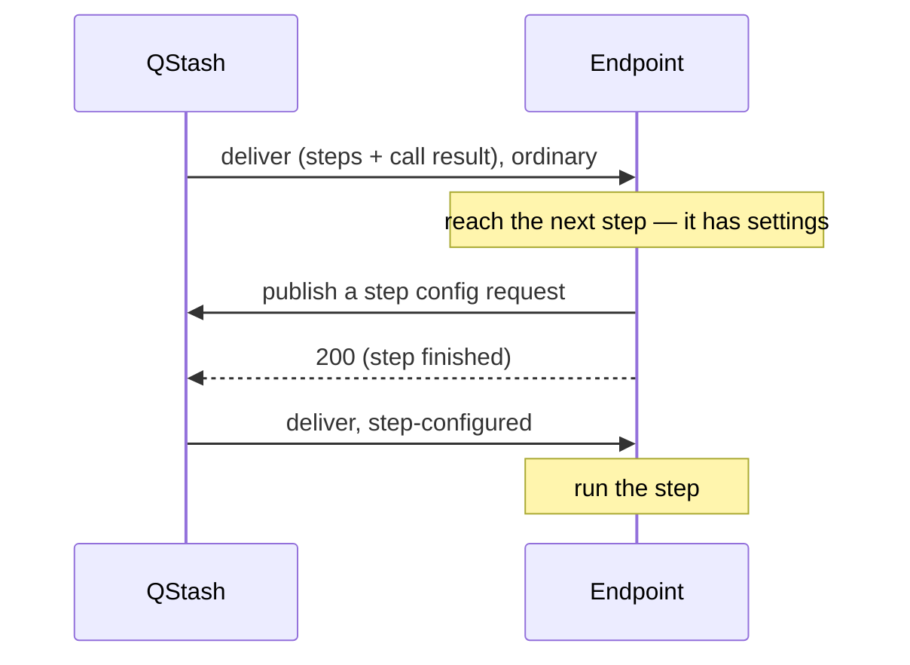
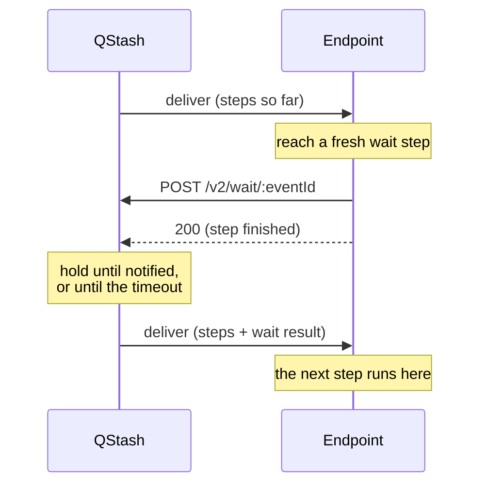
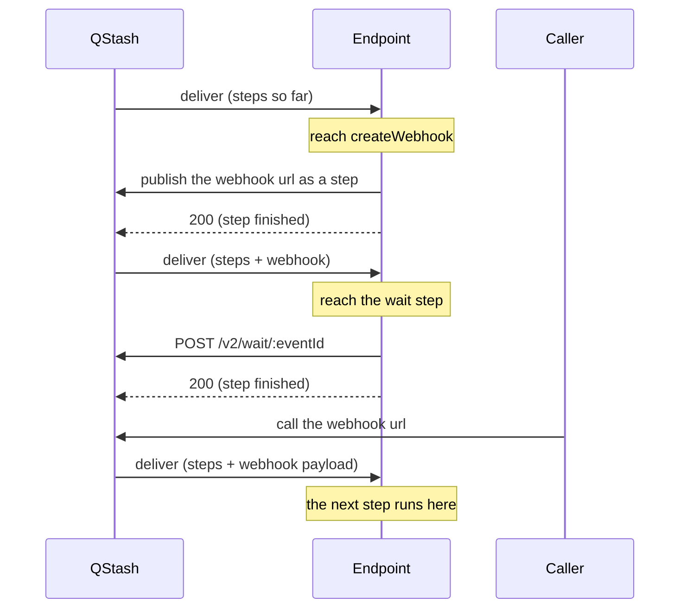

# Glossary

Vocabulary for the requests a workflow run is made of, and for step-level
configuration. This describes the protocol between the SDK and QStash, so it is
aimed at contributors rather than users of the SDK.

## Requests and deliveries

A run is a chain of QStash messages. Each one is **published** by someone (the
SDK, or QStash itself) and later **delivered** to the workflow endpoint. The two
halves matter separately, because a message's configuration is fixed when it is
published but only takes effect when it is delivered.

| Term                                       | Meaning                                                                                                                                                                                                                                                                      |
| ------------------------------------------ | ---------------------------------------------------------------------------------------------------------------------------------------------------------------------------------------------------------------------------------------------------------------------------- |
| **Delivery**                               | One HTTP request from QStash to the workflow endpoint, i.e. one invocation of the route function. Every delivery replays the workflow from the top over the memoized steps.                                                                                                  |
| **Trigger request**                        | The message that starts a run (`Upstash-Workflow-Init: true`), published by `client.trigger` or by the endpoint on a direct POST. Carries the initial payload and establishes the run's trigger configuration.                                                               |
| **Step request**                           | A message whose body is a step result (call type `step`). QStash records it as a step of the run; **its delivery is what executes the next step**.                                                                                                                           |
| **Plan step request**                      | One message of the batch published when a parallel group starts. Names a `targetStep`; its delivery executes that step.                                                                                                                                                      |
| **Call request** / **call result request** | Call types `toCallback` / `fromCallback`: the outbound `context.call` and the result QStash posts back to the endpoint.                                                                                                                                                      |
| **Invoke result delivery**                 | The delivery QStash publishes to the invoker when a `context.invoke` child run finishes. Published by QStash, not by the SDK.                                                                                                                                                |
| **Step-config request**                    | A message that carries **only configuration** — no step result, no body of consequence (call type `stepConfig`). It is not recorded as a step and is hidden from the step logs. Its sole purpose is to produce a step-configured delivery. Informally: an _empty republish_. |

## Configuration

| Term                                         | Meaning                                                                                                                                                                                                                                                                                                                                |
| -------------------------------------------- | -------------------------------------------------------------------------------------------------------------------------------------------------------------------------------------------------------------------------------------------------------------------------------------------------------------------------------------- |
| **Trigger configuration**                    | Flow control, retries, retry delay and failure callback supplied at trigger time. QStash re-applies it to every later message of the run (feature `WF_TriggerOnConfig`).                                                                                                                                                               |
| **Step-level configuration** (step settings) | Flow control / retries / retry delay attached to a single step with `context.run(...).withSettings(...)`.                                                                                                                                                                                                                              |
| **Effective configuration**                  | What QStash actually applied to the delivery in hand. Echoed back to the endpoint on every delivery as `Upstash-Flow-Control-Key`, `Upstash-Flow-Control-Value`, `Upstash-Max-Retries` and `Upstash-Retry-Delay` (`pkg/deliver/deliver.go`, `AddUpstashHeaders`). Exposed on the context as `flowControl`, `retries` and `retryDelay`. |
| **Step-configured delivery**                 | A delivery whose message carried step-level configuration, so QStash applied it: the flow-control slot is held for the duration of this delivery and retries come from the step.                                                                                                                                                       |
| **Ordinary delivery**                        | A delivery running under the trigger configuration.                                                                                                                                                                                                                                                                                    |
| **Config mismatch**                          | The executor is about to execute a step whose step-level configuration differs from the effective configuration of the delivery it is running in.                                                                                                                                                                                      |
| **`WF_StepConfig`**                          | Publish-side feature flag telling QStash to keep the message's own configuration rather than overwriting it with the trigger configuration.                                                                                                                                                                                            |
| **Guard marker**                             | `Upstash-Workflow-Step-Config: true` on a delivery, meaning "this message was published with step-level configuration". See [Deciding about a step's settings](#deciding-about-a-steps-settings).                                                                                                                                      |

## Execution

| Term                    | Meaning                                                                                                                                                                                                                                                                                      |
| ----------------------- | -------------------------------------------------------------------------------------------------------------------------------------------------------------------------------------------------------------------------------------------------------------------------------------------- |
| **Replay**              | Re-running the route function from the top on each delivery. Steps already recorded return their stored result; non-step code between steps runs again on every delivery.                                                                                                                    |
| **Memoized step**       | A step whose result is already in the run's step list, returned without executing the step function.                                                                                                                                                                                         |
| **Deferred submission** | Executing a step, holding its result instead of submitting immediately, and continuing the route function far enough to reach the next step — so that step's configuration can ride on the submission and no step-config request is needed. See [Deferred submission](#deferred-submission). |

## Deciding about a step's settings

Every step the SDK is about to run for the first time goes through this, and
there is no other place a step's settings are considered:

Which is the same decision as:

| Effective configuration | Guard marker | Action                               |
| ----------------------- | ------------ | ------------------------------------ |
| matches the step's      | —            | execute                              |
| differs                 | absent       | publish a step-config request, abort |
| differs                 | present      | **execute anyway**, and warn         |

The third row is a bounded failure mode, not a normal path: it means a
configuration the SDK published did not come back in a form it recognises,
almost certainly a normalization bug. Executing with the wrong configuration is
deliberately preferred over publishing a second step-config request, which would
loop forever and invisibly, since these requests are hidden from the step logs.
The warning is dispatched as `onWarning`, which reaches both any user
middleware and the console, and prints both configurations verbatim so the
mismatching field is identifiable.

The guard marker is set by QStash, from the `WF_StepConfig` feature of the
message being delivered (`AddUpstashHeaders`). Deriving it from what QStash
actually did rather than having the SDK forward a header alongside the settings
means the invariant _delivery carries step configuration ⟺ marker present_
cannot be broken by an SDK which sets the configuration but forgets the marker,
and every SDK gets it without doing anything.

Server-side backstops, which hold whatever a client does. They stop a loop in
three different ways, and only the last one ends the run visibly:

| Backstop                  | Fires when                                                                                | What the client sees                                                                        | What happens to the run                                                                                                          |
| ------------------------- | ----------------------------------------------------------------------------------------- | ------------------------------------------------------------------------------------------- | -------------------------------------------------------------------------------------------------------------------------------- |
| **Content deduplication** | a step config request for the same step is published twice                                | the publish succeeds, with `deduplicated: true`                                             | **Stalls.** No new message was created, so no further delivery follows. The run is neither finished nor failed; it simply stops. |
| **Two in a row**          | a step config request is published while the run's last entry is also one                 | the publish returns 400, which the SDK reports as "tried to append to a cancelled workflow" | **Stalls**, as above. The delivery still returns 200.                                                                            |
| **Entry limit**           | the run has appended more than `MaxEntriesPerCountableStep` messages per step it may take | the delivery is answered `-1 EXCEEDS_LIMIT` (429)                                           | **Fails.** The run is failed and the failure callback fires, like any other limit.                                               |

The ordering is what makes the stalls acceptable: deduplication fires first and is
usually not a bug at all — it is what happens when the delivery which published a
step config request fails and QStash retries it, where the original request is
still on its way and a second one would execute the step twice. Only a client
which keeps asking for the same step reaches it in the looping sense, and that
client is broken. The entry limit is the one that catches a loop which evades
both, and it is the one that ends the run properly.

A stalled run is the weak point here: nothing fails, no callback fires, and every
delivery returned 200, so the only symptom is a run which never completes. The
SDK therefore warns when its step config request comes back deduplicated, which
is the only trace that case leaves.

The rules themselves:

- QStash rejects a step config request when the run's last entry is also one. Two
  of them with no `step` entry in between is always a bug: every legitimate path
  puts a step entry between them.
- A run may append at most `MaxEntriesPerCountableStep` messages per step it is
  allowed to take (`exceedsWorkflowLimit`). The rule above only catches two step
  config requests _in a row_, so a client alternating them with some other
  message slips past it; the step count limit does not catch that either, because
  only result steps are countable. This bounds the total instead, using a counter
  the run already maintains. Without it the only ceiling is the context size
  limit, which a loop of small messages reaches after millions of iterations.
- A step config request is published with content based deduplication. The
  deduplication hash covers the run id, so runs never collide.

## Deferred submission

Applies when the step that just executed can produce its result in-process. The
route function continues until it reveals what comes next, and the pending result
is then submitted with that step's configuration attached. Identical in both
executing rows of the decision above — a step that ran in the degraded row
still needs the next step's configuration on its submission, and the next
delivery re-decides from scratch.

Its result is not submitted yet. The route function carries on with it, and what
that function reaches next decides what the result is submitted with:

The left branch is the one that costs nothing: a step's settings reach QStash on
a message that was going to be sent anyway. Every other branch leaves the next
step to ask for its own delivery, which is the extra request a step config
request pays for.

Four outcomes, all ending in submit + abort:

| What the continuation reaches              | Configuration attached to the pending submission                                           |
| ------------------------------------------ | ------------------------------------------------------------------------------------------ |
| a single step                              | that step's settings, if it has any                                                        |
| a parallel group                           | none — plan steps carry their own                                                          |
| route function returns                     | none                                                                                       |
| route function throws / `context.cancel()` | none; the error is swallowed for this invocation and re-occurs deterministically on replay |

Rules worth keeping in mind:

- **Always attach the next step's settings if it has any**, rather than skipping
  when they look equal to the current delivery's effective configuration. The
  executor only knows the _current_ delivery's configuration, which inside a
  step-configured delivery is the previous step's — so that comparison would be wrong
  exactly in the case of two steps with settings in a row.
- **Deferrable means `getResultStep` produces the final `out`** — not "no server
  round trip". `LazyCreateWebhookStep` computes its result entirely in-process
  but does so in `getBody`, returning `out: undefined` from `getResultStep`, so
  deferring it would hand `undefined` to the route function and then throw on
  `allowUndefinedOut: false`. `LazyNotifyStep` extends `LazyFunctionStep` and so
  inherits deferral, which is correct but easy to change by accident.
- **The flush runs inside the existing `deferExecution().then(...)` before
  `getExecutionPromise`**, so that `withSettings` — chained synchronously on the
  returned promise — has already applied, and so the next step's _function_ never
  runs. Constructing a lazy step does not invoke it.
- **Code after the last step runs one extra time**: once in the invocation that
  executed the step, once more in the final replay. This is the general property
  that non-step code re-runs on every delivery, but it is most visible at the
  tail, and it is why the CI helper waits for the expected call count rather than
  the first result it sees.

## Flows

What changed between the SDK and QStash, in one paragraph: **a step whose
result the SDK produces itself** — `context.run`, `sleep`, `sleepUntil`,
`notify` — no longer submits that result and stops. It holds the result, hands
it to the route function and lets it carry on until the next step appears, then
submits. The number of deliveries is the same; only the moment of submission
moved. Every other step kind — `call`, `invoke`, `waitForEvent`,
`waitForWebhook`, `createWebhook` — is unchanged, because its result comes from
QStash rather than from the SDK, so there is nothing to hold.

That change is what step-level settings ride on. A step's settings have to be on
the message whose delivery executes it, and the SDK only learns a step exists
when the route function reaches it — by which point the delivery it is running
in was already published. Holding the previous step's result leaves one message
still unsent at that moment, so the settings can travel on it. When there is no
such message the SDK publishes a [step config request](#requests-and-deliveries)
instead, which costs one extra delivery.

**Only `context.run` takes settings.** It is the one method returning a
`RunStepPromise`, which is what carries `withSettings`. Steps inside a parallel
group take them too, and never need a step config request: each plan step is
published knowing its target, so the settings go straight onto it.

So a step config request is needed exactly when the step before was **not** one
the SDK could hold — the run's first step, or a step after a `call`, `invoke`,
`waitForEvent`, `waitForWebhook` or a parallel group.

### `context.run`

Before, the result was submitted the moment the step finished:

Now it is held until the route function shows what comes next. Same deliveries,
later submission:

When that next step has settings, they travel on the same message. Nothing extra
is published:

When the step with settings is reached in a delivery which was **not** published
with them — the run's first step, or a step after one the SDK could not hold —
the settings need a message of their own:

### `context.call`

Unchanged. The third party's response is produced by QStash, so the SDK has
nothing to hold and submits the call itself before stopping:

That last delivery carries the call result, and was published before the SDK
knew what came after it — so a step with settings there needs a step config
request:

### `context.waitForEvent`

Unchanged. The wait is registered with QStash, which holds the run until the
event arrives or the timeout passes:

As with `call`, the delivery carrying the wait result predates the step after
it, so settings there need a step config request — the same shape as the
diagram above.

### `context.waitForWebhook`

Two steps: `createWebhook` mints the url, then the wait holds the run. Neither
result is one the SDK holds, so both submit and stop:

Again, a step with settings after the wait needs a step config request.

## Configuration normalization

That decision compares the step's configuration against the effective
configuration echoed by the server. Both sides must be parsed into a canonical
form; **never compare the header strings**. The known divergences, all live
today:

- The server joins flow-control values with `","`, the SDK's `prepareFlowControl`
  with `", "`.
- The server emits `period=%d` in seconds; the SDK sends duration strings such as
  `period=60s`.
- The SDK accepts `rate` and `ratePerSecond` as aliases for the same field.
- QStash defaults an unset flow-control period to one second (`parseFlowControl`)
  and reports it back, so a flow control published with only a `parallelism`
  comes back carrying `period=1`. Parallelism and rate default to 0 and are
  omitted from the header when unset. Both sides take these same defaults before
  comparing.
- `Upstash-Retries` on a **delivery** does not mean what it means on a publish.
  On a publish it sets the retry limit; on a delivery it reports how many retries
  have already happened (`message.Retries` is a counter incremented in
  `worker/context.go`), duplicating `Upstash-Retried`. The configured limit is
  `message.MaxRetries`, reported separately as `Upstash-Max-Retries`. That header
  is sent unconditionally, so an absent one means "this QStash version does not
  report it" rather than "the limit is zero" — zero being a valid limit. Retries
  are left uncompared in that case and the run's configuration applies.

Compare **only the fields the step specifies**. The server's fallback is
per-field for retries and retry delay but all-or-nothing for flow control
(`modifyConfigurationForWorkflow`), so a step that sets only `retries`
legitimately inherits the run's flow control; comparing flow control there would
mismatch on every delivery.

`timeout` is deliberately not part of step-level configuration:
`AddUpstashHeaders` does not echo it, so a mismatch in it could never be detected
and the setting would silently never apply.

Both of the divergences above were found by the guard marker firing during a live
run, not by unit tests. That is the argument for keeping the live normalization
matrix: a unit test can only check the SDK against its own assumptions, and every
failure mode here is a disagreement with the server.

## Naming note

The call type was originally `discovery`, named when the SDK learned the next
step's configuration by replaying the route function in a separate "discovery"
mode. That mode is gone — the normal replay reaches the step and compares
configurations directly — so the call type is `stepConfig`, on both the server
(`types.CallType`) and the SDK (the raw-step call type union).
